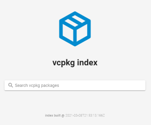

# vcpkg index
An online index of packages for the [vcpkg](https://github.com/microsoft/vcpkg/) package manager - updated every day at midnight.
    
  

**goto [📦 vcpkg index](https://bitmeal.github.io/vcpkg-index)**

## how does it work
An index is build from all `vcpkg.json` and `CONTROL` files of all ports. All filtering and searching happens client side. Updates to the index are automatically performed each day @`00:00`.
